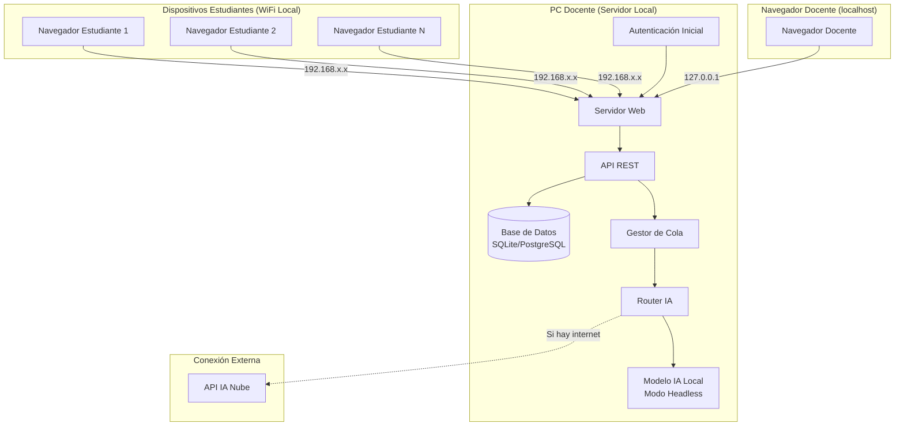
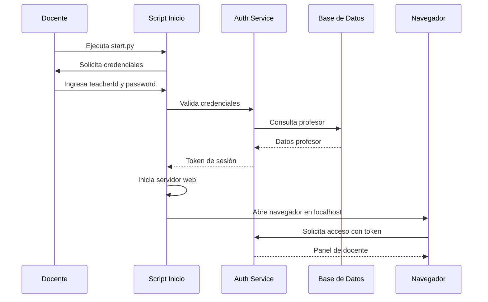
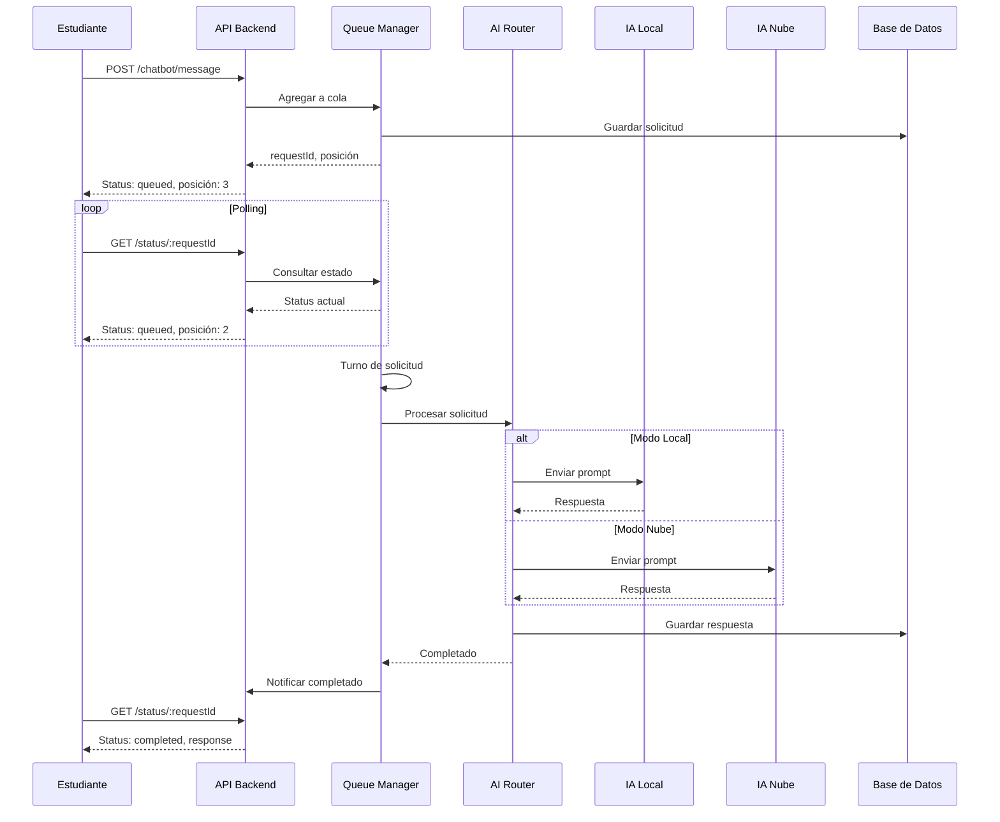
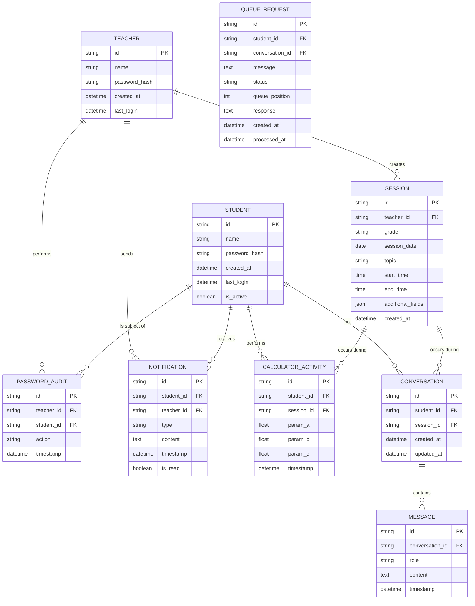

# Documento de Diseño Técnico

## Introducción

Este documento describe el diseño técnico de la plataforma web educativa autocontenida para la enseñanza de funciones cuadráticas. El sistema está optimizado para contextos educativos rurales con recursos limitados y conectividad intermitente o inexistente.

La arquitectura prioriza la simplicidad de configuración, el uso eficiente de recursos de hardware, y la extensibilidad futura a nuevos temas y asignaturas.

## Visión General del Sistema

La plataforma implementa una arquitectura cliente-servidor local donde el PC del docente actúa como servidor web al que los estudiantes se conectan mediante WiFi local. El sistema soporta dos modos de operación de IA (local y nube) con gestión automática de capacidad y recursos.

### Características Principales

- Servidor web local autocontenido
- Autenticación diferenciada por origen de conexión
- Calculadora graficadora interactiva de funciones cuadráticas
- Chatbot pedagógico con metodología socrática
- Dashboards de rendimiento para estudiantes y docentes
- Sistema de cola para gestión de solicitudes de IA
- Persistencia completa de datos en base de datos local
- Optimización para equipos con recursos limitados (4GB RAM mínimo)

## Overview

### Arquitectura del Sistema

El sistema implementa una arquitectura modular de tres capas:

**Capa de Presentación (Frontend)**
- Aplicación web SPA (Single Page Application)
- Interfaz responsive accesible desde navegadores
- Componentes reutilizables para calculadora, chatbot y dashboards

**Capa de Lógica de Negocio (Backend)**
- Servidor web con API RESTful
- Middleware de autenticación y autorización basado en origen
- Gestor de cola de solicitudes de IA
- Orquestador de servicios de IA (local/nube)

**Capa de Datos**
- Base de datos relacional local
- Sistema de persistencia de sesiones
- Almacenamiento de historial de conversaciones


### Diagrama de Arquitectura




## Architecture

### Stack Tecnológico

#### Backend

**Framework Web:** Flask (Python) o Express.js (Node.js)
- Justificación: Ligero, fácil de configurar, bajo consumo de recursos
- Flask recomendado por mejor integración con modelos de IA locales en Python

**Servidor Web:** Gunicorn (Flask) o integrado (Express)
- Configuración automática de puerto y exposición en red local
- Soporte para múltiples workers según recursos disponibles

**Gestión de IA:**
- **IA Local:** Ollama con modelos optimizados (Llama 3.2 3B o similar)
  - Ejecución en modo headless
  - API REST local para comunicación
- **IA Nube:** OpenAI API, Anthropic Claude API, o Google Gemini API
  - Fallback automático según disponibilidad
  - Rate limiting integrado (20 solicitudes paralelas)

**Sistema de Cola:** Redis Lite o implementación en memoria con persistencia
- Cola FIFO para solicitudes de IA
- Gestión de estado de solicitudes
- Persistencia de cola en caso de reinicio

#### Frontend

**Framework:** React con TypeScript o Vue.js 3
- Justificación: Componentes reutilizables, estado reactivo, ecosistema maduro
- React recomendado por mayor disponibilidad de librerías de gráficos

**Librería de Gráficos:** Plotly.js o Chart.js con plugin de funciones
- Renderizado de parábolas en tiempo real
- Interactividad para zoom y exploración
- Cálculo de puntos críticos (vértice, raíces, intersecciones)

**Gestión de Estado:** Redux Toolkit (React) o Pinia (Vue)
- Estado global para sesión de usuario
- Caché de datos de dashboard
- Sincronización de estado de cola

**UI Components:** Material-UI (React) o Vuetify (Vue)
- Componentes accesibles y responsive
- Tema personalizable para contexto educativo
- Soporte para español nativo

**Comunicación:** Axios para HTTP, Socket.io para actualizaciones en tiempo real
- WebSockets para notificaciones de cola
- Polling como fallback

#### Base de Datos

**Motor:** SQLite para simplicidad o PostgreSQL para escalabilidad
- **SQLite recomendado** para cumplir requisito de autocontención
- Archivo de base de datos dentro de carpeta del proyecto
- Migraciones con Alembic (Python) o Knex.js (Node.js)

**ORM:** SQLAlchemy (Python) o Sequelize (Node.js)
- Abstracción de consultas
- Validación de modelos
- Gestión de relaciones


### Estructura de Carpetas del Proyecto

```
plataforma-educativa/
├── backend/
│   ├── app.py                    # Punto de entrada del servidor
│   ├── config.py                 # Configuración del sistema
│   ├── auth/
│   │   ├── middleware.py         # Middleware de autenticación por origen
│   │   └── models.py             # Modelos de usuario
│   ├── api/
│   │   ├── routes/
│   │   │   ├── auth.py           # Endpoints de autenticación
│   │   │   ├── calculator.py     # Endpoints de calculadora
│   │   │   ├── chatbot.py        # Endpoints de chatbot
│   │   │   ├── dashboard.py      # Endpoints de dashboard
│   │   │   └── admin.py          # Endpoints de gestión docente
│   │   └── validators.py         # Validadores de entrada
│   ├── services/
│   │   ├── ai_router.py          # Router de IA (local/nube)
│   │   ├── queue_manager.py      # Gestor de cola de solicitudes
│   │   ├── calculator_service.py # Lógica de cálculo de funciones
│   │   └── export_service.py     # Generación de HTML exportable
│   ├── models/
│   │   ├── user.py               # Modelo de usuarios
│   │   ├── session.py            # Modelo de sesiones de clase
│   │   ├── conversation.py       # Modelo de conversaciones
│   │   ├── activity.py           # Modelo de actividades
│   │   └── notification.py       # Modelo de avisos/retroalimentación
│   ├── database/
│   │   ├── db.py                 # Configuración de base de datos
│   │   └── migrations/           # Scripts de migración
│   └── requirements.txt          # Dependencias Python
├── frontend/
│   ├── public/
│   │   └── index.html
│   ├── src/
│   │   ├── App.tsx               # Componente raíz
│   │   ├── main.tsx              # Punto de entrada
│   │   ├── components/
│   │   │   ├── Calculator/
│   │   │   │   ├── GraphPlotter.tsx
│   │   │   │   ├── ParameterControls.tsx
│   │   │   │   └── FunctionDisplay.tsx
│   │   │   ├── Chatbot/
│   │   │   │   ├── ChatInterface.tsx
│   │   │   │   ├── MessageList.tsx
│   │   │   │   ├── InputBox.tsx
│   │   │   │   └── QueueIndicator.tsx
│   │   │   ├── Dashboard/
│   │   │   │   ├── StudentDashboard.tsx
│   │   │   │   ├── TeacherDashboard.tsx
│   │   │   │   ├── StudentCard.tsx
│   │   │   │   └── MetricsChart.tsx
│   │   │   ├── Auth/
│   │   │   │   ├── LoginForm.tsx
│   │   │   │   ├── RegisterForm.tsx
│   │   │   │   └── SessionRegistration.tsx
│   │   │   └── Admin/
│   │   │       ├── PasswordManager.tsx
│   │   │       └── StudentModeToggle.tsx
│   │   ├── pages/
│   │   │   ├── TeacherPanel.tsx
│   │   │   └── StudentPanel.tsx
│   │   ├── store/
│   │   │   ├── authSlice.ts
│   │   │   ├── calculatorSlice.ts
│   │   │   ├── chatSlice.ts
│   │   │   └── dashboardSlice.ts
│   │   ├── services/
│   │   │   └── api.ts            # Cliente API
│   │   └── utils/
│   │       ├── mathUtils.ts      # Utilidades matemáticas
│   │       └── validators.ts     # Validadores frontend
│   ├── package.json
│   └── tsconfig.json
├── data/
│   └── plataforma.db             # Base de datos SQLite
├── ai_models/                    # Modelos de IA local (opcional)
│   └── README.md                 # Instrucciones de instalación
├── docs/
│   ├── INSTALACION.md            # Guía de instalación
│   ├── USO_DOCENTE.md            # Manual para docentes
│   └── ARQUITECTURA.md           # Documentación técnica
├── scripts/
│   ├── start.py                  # Script de inicio con autenticación
│   └── setup.py                  # Script de configuración inicial
└── README.md
```


## Components and Interfaces

### Componente 1: Sistema de Autenticación y Autorización

**Responsabilidad:** Gestionar la autenticación diferenciada por origen de conexión y roles de usuario.

**Subcomponentes:**

1. **Middleware de Detección de Origen**
   - Detecta si la conexión proviene de localhost (127.0.0.1) o IP local
   - Aplica reglas de acceso según origen
   - Bloquea acceso a rutas de docente desde conexiones remotas

2. **Gestor de Autenticación de Docente**
   - Autenticación previa al inicio del servidor
   - Validación de credenciales contra base de datos
   - Generación de token de sesión para navegador
   - Apertura automática de navegador tras autenticación exitosa

3. **Gestor de Autenticación de Estudiante**
   - Login/registro de estudiantes
   - Validación de credenciales
   - Gestión de sesiones de estudiante
   - Persistencia de sesión en navegador

**Interfaces:**

```typescript
// API de Autenticación
POST /api/auth/teacher/login
  Request: { teacherId: string, password: string }
  Response: { token: string, teacherName: string }

POST /api/auth/student/login
  Request: { studentId: string, password: string }
  Response: { token: string, studentName: string, role: 'student' }

POST /api/auth/student/register
  Request: { studentId: string, password: string, name: string }
  Response: { token: string, studentName: string }

GET /api/auth/validate
  Headers: { Authorization: 'Bearer <token>' }
  Response: { valid: boolean, role: string, userId: string }

POST /api/auth/logout
  Headers: { Authorization: 'Bearer <token>' }
  Response: { success: boolean }
```

**Flujo de Autenticación del Docente:**




### Componente 2: Calculadora Graficadora

**Responsabilidad:** Renderizar y manipular funciones cuadráticas de forma interactiva.

**Subcomponentes:**

1. **Motor de Cálculo Matemático**
   - Evaluación de función cuadrática f(x) = ax² + bx + c
   - Cálculo de vértice: (-b/2a, f(-b/2a))
   - Cálculo de raíces usando fórmula cuadrática
   - Cálculo de intersección con eje Y (c)
   - Validación de parámetros en rango [-30, 30]
   - Validación de a ≠ 0

2. **Renderizador de Gráficos**
   - Generación de puntos de la parábola
   - Renderizado con Plotly.js
   - Marcadores visuales para vértice y raíces
   - Actualización en tiempo real

3. **Controles Interactivos**
   - Deslizadores para a, b, c
   - Campos de entrada manual con validación
   - Sincronización bidireccional entre deslizadores y campos

**Interfaces:**

```typescript
// API de Calculadora
POST /api/calculator/evaluate
  Request: { 
    a: number,  // [-30, 30], a ≠ 0
    b: number,  // [-30, 30]
    c: number   // [-30, 30]
  }
  Response: {
    vertex: { x: number, y: number },
    roots: { x1: number | null, x2: number | null },
    yIntercept: number,
    points: Array<{ x: number, y: number }>,
    formula: string
  }

POST /api/calculator/activity
  Request: {
    studentId: string,
    parameters: { a: number, b: number, c: number },
    timestamp: string
  }
  Response: { activityId: string, saved: boolean }
```

**Estructura de Datos del Frontend:**

```typescript
interface QuadraticFunction {
  a: number;
  b: number;
  c: number;
}

interface CalculatorState {
  parameters: QuadraticFunction;
  vertex: { x: number; y: number } | null;
  roots: { x1: number | null; x2: number | null };
  yIntercept: number;
  plotPoints: Array<{ x: number; y: number }>;
  isValid: boolean;
  validationErrors: string[];
}
```


### Componente 3: Chatbot Socrático con Sistema de Cola

**Responsabilidad:** Proporcionar asistencia pedagógica mediante metodología socrática con gestión eficiente de recursos.

**Subcomponentes:**

1. **Gestor de Cola de Solicitudes**
   - Cola FIFO para solicitudes de estudiantes
   - Seguimiento de posición en cola
   - Notificación de cambios de estado
   - Procesamiento secuencial (IA local) o paralelo (IA nube, máx 20)

2. **Router de IA**
   - Detección de conectividad a internet
   - Selección automática entre IA local y nube
   - Fallback automático en caso de fallo
   - Gestión de límites de tasa

3. **Procesador de Conversaciones**
   - Construcción de contexto con historial
   - Aplicación de prompt socrático
   - Filtrado de dominio (solo funciones cuadráticas)
   - Persistencia de mensajes

4. **Gestor de Historial**
   - Carga de conversaciones previas
   - Almacenamiento incremental
   - Asociación con estudiante

**Interfaces:**

```typescript
// API de Chatbot
POST /api/chatbot/message
  Request: {
    studentId: string,
    message: string,
    conversationId?: string
  }
  Response: {
    requestId: string,
    status: 'queued' | 'processing' | 'completed',
    queuePosition?: number,
    estimatedWaitTime?: number
  }

GET /api/chatbot/status/:requestId
  Response: {
    status: 'queued' | 'processing' | 'completed' | 'error',
    queuePosition?: number,
    response?: string,
    error?: string
  }

GET /api/chatbot/history/:studentId
  Response: {
    conversations: Array<{
      id: string,
      messages: Array<{
        role: 'student' | 'assistant',
        content: string,
        timestamp: string
      }>,
      createdAt: string,
      updatedAt: string
    }>
  }

GET /api/chatbot/queue/status
  Response: {
    mode: 'local' | 'cloud',
    queueLength: number,
    processing: number,
    maxParallel: number
  }
```

**Flujo de Procesamiento de Solicitud:**




**Configuración del Prompt Socrático:**

```python
SOCRATIC_SYSTEM_PROMPT = """
Eres un tutor matemático que utiliza el método socrático para enseñar funciones cuadráticas.

REGLAS ESTRICTAS:
1. NUNCA des respuestas directas a problemas matemáticos
2. SIEMPRE responde con preguntas guía que ayuden al estudiante a descubrir la respuesta
3. SOLO discute temas relacionados con funciones cuadráticas de la forma f(x) = ax² + bx + c
4. Si el estudiante pregunta sobre otros temas, redirige amablemente hacia funciones cuadráticas
5. Usa lenguaje claro y apropiado para estudiantes de secundaria
6. Celebra el progreso del estudiante con refuerzo positivo
7. Si el estudiante está muy perdido, proporciona pistas más específicas pero nunca la respuesta completa

TEMAS PERMITIDOS:
- Definición y forma general de funciones cuadráticas
- Parámetros a, b, c y su efecto en la parábola
- Vértice y cómo calcularlo
- Raíces y discriminante
- Intersección con ejes
- Concavidad (hacia arriba/abajo)
- Aplicaciones prácticas de funciones cuadráticas

IDIOMA: Español

EJEMPLO DE INTERACCIÓN:
Estudiante: "¿Cuál es el vértice de f(x) = 2x² + 4x + 1?"
Asistente: "Excelente pregunta. Para encontrar el vértice, primero necesitamos identificar los valores de a, b y c en tu función. ¿Puedes decirme cuáles son esos valores?"
"""
```


### Componente 4: Dashboards de Rendimiento

**Responsabilidad:** Visualizar métricas de rendimiento y progreso de aprendizaje.

**Subcomponentes:**

1. **Dashboard Personal del Estudiante**
   - Métricas de uso de calculadora (funciones exploradas, tiempo de uso)
   - Estadísticas de chatbot (preguntas realizadas, temas consultados)
   - Avisos y retroalimentación del docente
   - Progreso temporal

2. **Dashboard del Docente**
   - Vista general de todos los estudiantes
   - Métricas individuales por estudiante
   - Comparativas de rendimiento
   - Herramientas de comunicación (avisos, retroalimentación)
   - Exportación a HTML

3. **Generador de Reportes**
   - Agregación de datos de actividad
   - Cálculo de métricas
   - Generación de gráficos
   - Exportación a HTML estático

**Interfaces:**

```typescript
// API de Dashboard
GET /api/dashboard/student/:studentId
  Response: {
    student: {
      id: string,
      name: string,
      registeredAt: string
    },
    calculatorMetrics: {
      totalSessions: number,
      totalTimeMinutes: number,
      functionsExplored: number,
      lastActivity: string
    },
    chatbotMetrics: {
      totalQuestions: number,
      totalConversations: number,
      averageQuestionsPerConversation: number,
      lastInteraction: string
    },
    notifications: Array<{
      id: string,
      type: 'notice' | 'feedback',
      content: string,
      from: string,
      timestamp: string,
      read: boolean
    }>
  }

GET /api/dashboard/teacher/overview
  Response: {
    totalStudents: number,
    activeStudents: number,
    currentConnections: number,
    maxCapacity: number,
    aiMode: 'local' | 'cloud',
    students: Array<{
      id: string,
      name: string,
      lastActive: string,
      calculatorActivity: number,
      chatbotActivity: number,
      status: 'online' | 'offline'
    }>
  }

GET /api/dashboard/teacher/student/:studentId
  Response: {
    // Misma estructura que dashboard/student
    // Más herramientas de gestión
  }

POST /api/dashboard/teacher/notification
  Request: {
    studentId: string,
    type: 'notice' | 'feedback',
    content: string
  }
  Response: {
    notificationId: string,
    sent: boolean
  }

POST /api/dashboard/teacher/export
  Request: {
    includeStudents?: string[],  // Si vacío, incluye todos
    dateRange?: { from: string, to: string }
  }
  Response: {
    htmlContent: string,
    filename: string
  }
```


### Componente 5: Gestión de Contraseñas

**Responsabilidad:** Permitir al docente visualizar y resetear contraseñas de estudiantes.

**Interfaces:**

```typescript
// API de Gestión de Contraseñas
GET /api/admin/students/passwords
  Headers: { Authorization: 'Bearer <teacher_token>' }
  Response: {
    students: Array<{
      id: string,
      name: string,
      password: string  // Solo visible para docente desde localhost
    }>
  }

PUT /api/admin/students/:studentId/password
  Headers: { Authorization: 'Bearer <teacher_token>' }
  Request: {
    newPassword: string
  }
  Response: {
    success: boolean,
    studentId: string,
    updatedAt: string
  }

// Registro de auditoría
GET /api/admin/audit/password-changes
  Response: {
    changes: Array<{
      studentId: string,
      studentName: string,
      changedBy: string,
      timestamp: string,
      action: 'view' | 'reset'
    }>
  }
```

**Consideraciones de Seguridad:**
- Endpoint solo accesible desde localhost
- Requiere token de docente válido
- Todas las operaciones se registran en auditoría
- Contraseñas almacenadas con hash bcrypt en producción
- Para contexto educativo rural, se permite visualización de contraseñas en texto plano para facilitar recuperación


### Componente 6: Registro de Sesiones de Clase

**Responsabilidad:** Capturar y almacenar información contextual de cada sesión de clase.

**Interfaces:**

```typescript
// API de Sesiones
POST /api/sessions/register
  Headers: { Authorization: 'Bearer <teacher_token>' }
  Request: {
    grade: string,
    date: string,
    topic: string,
    startTime: string,
    additionalFields?: Record<string, any>
  }
  Response: {
    sessionId: string,
    registered: boolean
  }

GET /api/sessions/current
  Response: {
    sessionId: string,
    teacherId: string,
    teacherName: string,
    grade: string,
    date: string,
    topic: string,
    startTime: string,
    activeStudents: number
  }

GET /api/sessions/history
  Response: {
    sessions: Array<{
      id: string,
      teacherId: string,
      grade: string,
      date: string,
      topic: string,
      startTime: string,
      endTime?: string,
      studentsCount: number,
      activitiesCount: number
    }>
  }
```


## Data Models

### Esquema de Base de Datos




### Definición de Modelos

#### Modelo: Teacher

```python
class Teacher(Base):
    __tablename__ = 'teachers'
    
    id = Column(String(50), primary_key=True)
    name = Column(String(200), nullable=False)
    password_hash = Column(String(255), nullable=False)
    created_at = Column(DateTime, default=datetime.utcnow)
    last_login = Column(DateTime)
    
    # Relaciones
    sessions = relationship('Session', back_populates='teacher')
    notifications_sent = relationship('Notification', back_populates='teacher')
    password_audits = relationship('PasswordAudit', back_populates='teacher')
```

#### Modelo: Student

```python
class Student(Base):
    __tablename__ = 'students'
    
    id = Column(String(50), primary_key=True)
    name = Column(String(200), nullable=False)
    password_hash = Column(String(255), nullable=False)
    created_at = Column(DateTime, default=datetime.utcnow)
    last_login = Column(DateTime)
    is_active = Column(Boolean, default=True)
    
    # Relaciones
    calculator_activities = relationship('CalculatorActivity', back_populates='student')
    conversations = relationship('Conversation', back_populates='student')
    notifications = relationship('Notification', back_populates='student')
```

#### Modelo: Session

```python
class Session(Base):
    __tablename__ = 'sessions'
    
    id = Column(String(50), primary_key=True)
    teacher_id = Column(String(50), ForeignKey('teachers.id'), nullable=False)
    grade = Column(String(50), nullable=False)
    session_date = Column(Date, nullable=False)
    topic = Column(String(200), nullable=False)
    start_time = Column(Time, nullable=False)
    end_time = Column(Time)
    additional_fields = Column(JSON)
    created_at = Column(DateTime, default=datetime.utcnow)
    
    # Relaciones
    teacher = relationship('Teacher', back_populates='sessions')
    calculator_activities = relationship('CalculatorActivity', back_populates='session')
    conversations = relationship('Conversation', back_populates='session')
```

#### Modelo: CalculatorActivity

```python
class CalculatorActivity(Base):
    __tablename__ = 'calculator_activities'
    
    id = Column(String(50), primary_key=True)
    student_id = Column(String(50), ForeignKey('students.id'), nullable=False)
    session_id = Column(String(50), ForeignKey('sessions.id'))
    param_a = Column(Float, nullable=False)
    param_b = Column(Float, nullable=False)
    param_c = Column(Float, nullable=False)
    timestamp = Column(DateTime, default=datetime.utcnow)
    
    # Validaciones
    __table_args__ = (
        CheckConstraint('param_a != 0', name='check_param_a_not_zero'),
        CheckConstraint('param_a >= -30 AND param_a <= 30', name='check_param_a_range'),
        CheckConstraint('param_b >= -30 AND param_b <= 30', name='check_param_b_range'),
        CheckConstraint('param_c >= -30 AND param_c <= 30', name='check_param_c_range'),
    )
    
    # Relaciones
    student = relationship('Student', back_populates='calculator_activities')
    session = relationship('Session', back_populates='calculator_activities')
```

#### Modelo: Conversation

```python
class Conversation(Base):
    __tablename__ = 'conversations'
    
    id = Column(String(50), primary_key=True)
    student_id = Column(String(50), ForeignKey('students.id'), nullable=False)
    session_id = Column(String(50), ForeignKey('sessions.id'))
    created_at = Column(DateTime, default=datetime.utcnow)
    updated_at = Column(DateTime, default=datetime.utcnow, onupdate=datetime.utcnow)
    
    # Relaciones
    student = relationship('Student', back_populates='conversations')
    session = relationship('Session', back_populates='conversations')
    messages = relationship('Message', back_populates='conversation', order_by='Message.timestamp')
```

#### Modelo: Message

```python
class Message(Base):
    __tablename__ = 'messages'
    
    id = Column(String(50), primary_key=True)
    conversation_id = Column(String(50), ForeignKey('conversations.id'), nullable=False)
    role = Column(Enum('student', 'assistant', name='message_role'), nullable=False)
    content = Column(Text, nullable=False)
    timestamp = Column(DateTime, default=datetime.utcnow)
    
    # Relaciones
    conversation = relationship('Conversation', back_populates='messages')
```

#### Modelo: Notification

```python
class Notification(Base):
    __tablename__ = 'notifications'
    
    id = Column(String(50), primary_key=True)
    student_id = Column(String(50), ForeignKey('students.id'), nullable=False)
    teacher_id = Column(String(50), ForeignKey('teachers.id'), nullable=False)
    type = Column(Enum('notice', 'feedback', name='notification_type'), nullable=False)
    content = Column(Text, nullable=False)
    timestamp = Column(DateTime, default=datetime.utcnow)
    is_read = Column(Boolean, default=False)
    
    # Relaciones
    student = relationship('Student', back_populates='notifications')
    teacher = relationship('Teacher', back_populates='notifications_sent')
```

#### Modelo: PasswordAudit

```python
class PasswordAudit(Base):
    __tablename__ = 'password_audits'
    
    id = Column(String(50), primary_key=True)
    teacher_id = Column(String(50), ForeignKey('teachers.id'), nullable=False)
    student_id = Column(String(50), ForeignKey('students.id'), nullable=False)
    action = Column(Enum('view', 'reset', name='audit_action'), nullable=False)
    timestamp = Column(DateTime, default=datetime.utcnow)
    
    # Relaciones
    teacher = relationship('Teacher', back_populates='password_audits')
    student = relationship('Student')
```

#### Modelo: QueueRequest

```python
class QueueRequest(Base):
    __tablename__ = 'queue_requests'
    
    id = Column(String(50), primary_key=True)
    student_id = Column(String(50), ForeignKey('students.id'), nullable=False)
    conversation_id = Column(String(50), ForeignKey('conversations.id'), nullable=False)
    message = Column(Text, nullable=False)
    status = Column(Enum('queued', 'processing', 'completed', 'error', name='request_status'), 
                   nullable=False, default='queued')
    queue_position = Column(Integer)
    response = Column(Text)
    created_at = Column(DateTime, default=datetime.utcnow)
    processed_at = Column(DateTime)
    
    # Relaciones
    student = relationship('Student')
    conversation = relationship('Conversation')
```


### Índices de Base de Datos

Para optimizar el rendimiento en consultas frecuentes:

```sql
-- Índices para búsquedas frecuentes
CREATE INDEX idx_student_last_login ON students(last_login);
CREATE INDEX idx_calculator_activity_student ON calculator_activities(student_id, timestamp);
CREATE INDEX idx_conversation_student ON conversations(student_id, updated_at);
CREATE INDEX idx_message_conversation ON messages(conversation_id, timestamp);
CREATE INDEX idx_notification_student_unread ON notifications(student_id, is_read, timestamp);
CREATE INDEX idx_queue_request_status ON queue_requests(status, created_at);
CREATE INDEX idx_session_teacher_date ON sessions(teacher_id, session_date);

-- Índice compuesto para dashboard de docente
CREATE INDEX idx_student_activity ON calculator_activities(student_id, session_id, timestamp);
```

